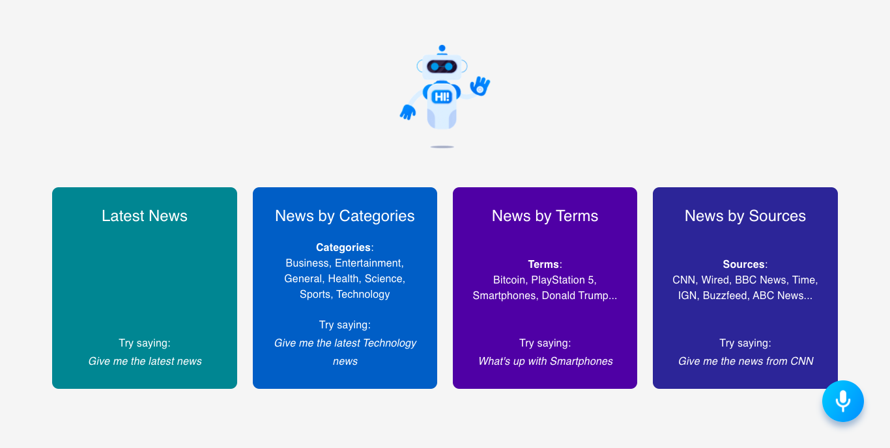

# Voice Controlled React News App

> [Live Link](https://voice-controlled-news-app.netlify.app/)

## Technologies using:

- React Hooks
- Words-to-numbers
- Alan AI
- Material UI

## Instructions::

This project requires [node.js](https://www.npmjs.com/get-npmhttps://www.npmjs.com/get-npm)

1. Fork this repo
2. Install project dependencies `npm install`
3. Create and add your own `REACT_APP_ALAN_KEY` environment variable using [Alan AI](https://alan.app/docs/usage/getting-started)
4. Start app `npm start`
5. Open your broswer - http://localhost:3000/
